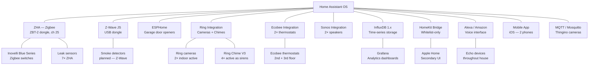

# System Architecture

## HA Instance

| Property | Value |
|---|---|
| Platform | Home Assistant OS (HAOS) |
| Version | 2026.5.4 |
| Hardware | Mini S13 PC (x86-64) — in structured media cabinet |
| Local access | `http://homeassistant.local:8123` |
| Remote access | Nabu Casa (URL stored in `secrets.yaml`) |
| Config storage | `/config/` on HAOS — version-controlled at this repo |

---

## Integration Map



---

## Protocols & Technologies

### Zigbee — ZHA
- **Coordinator:** ZBT-2 USB dongle on Sabrent USB hub + extension cable
- **Channel:** 25 (avoids 2.4 GHz WiFi overlap with channels 1, 6, 11)
- **Integration:** ZHA (not Zigbee2MQTT — Z2M is installed but not running)
- **Devices:** ~15 — Inovelli Blue Series switches, Third Reality leak sensors, mmWave sensors
- **Inovelli support:** Full LED notification, multi-tap events, and parameter config via ZHA "Manage Zigbee Device"

!!! warning "Zigbee mesh health"
    Always pair mains-powered devices (switches, plugs) before battery sensors. Wait 24 hours after adding powered devices before testing signal — neighbor tables rebuild gradually.

### Z-Wave — Z-Wave JS
- Dongle installed, lightly used
- Reserved for: smoke detectors (First Alert ZCOMBO-G), smart locks (Schlage BE469ZP)
- No devices currently paired

### ESPHome
- 2× garage door openers (custom firmware)
- Entities: `cover.left_garage_door_opener_garage_door`, `cover.right_garage_door_opener_garage_door`

!!! note "Entity naming quirk"
    `cover.left_garage_door_opener_garage_door` is physically the **right** door — naming mismatch from installer. UI labels reflect physical reality.

### Ring
- 2× Ring Indoor Cams active (garage + personnel door)
- 4× Ring Chime V3 active as `siren.[name]` entities
- Cloud-based — streams and recordings go through Ring's servers
- Only 2 tones available for chimes: `ding` and `motion`

### Ecobee
- Native HA integration
- Also paired directly to Apple Home (bypasses HA HomeKit Bridge)
- `heat_cool` mode (dual setpoint) on both units
- Eco+ TOU enabled in Ecobee app — no HA setpoint automation runs

### MQTT / Mosquitto
- Mosquitto broker add-on running on HA
- Used by: Thingino-flashed Wyze v3 camera (motion events, when configured)

### InfluxDB + Grafana
- InfluxDB 1.x — receives all HA state changes
- Uses **InfluxQL** (not Flux) — Grafana data source configured accordingly
- Grafana running as HA add-on — analytics dashboards for temperature, energy, presence

---

## Dashboard

- **Name:** Home Command Dashboard
- **Storage:** `/config/.storage/lovelace.home_command_dashboard` (JSON) on HAOS
- **Reference copy:** `dashboard.yaml` in this repo (not the live file)
- **Custom components:** `button-card`, `mushroom-climate-card`, `mushroom-title-card`, `apexcharts-card`
- **Tabs:** Overview · Energy · Climate · Security · Audio · Health · Lighting · Sleep

### Dashboard Edit Workflow

```bash
# 1. Pull fresh copy before editing
ssh root@192.168.x.x "cat /config/.storage/lovelace.home_command_dashboard" > /tmp/lovelace_dashboard.json

# 2. Edit via Python script in /tmp/

# 3. Push and restart immediately (race condition: HA may overwrite on shutdown)
scp /tmp/lovelace_dashboard.json root@192.168.x.x:/config/.storage/lovelace.home_command_dashboard
ssh root@192.168.x.x "ha core restart"
```

---

## File Layout

| File | Role |
|---|---|
| `configuration.yaml` | Main HA config — includes, TOU sensors, `input_boolean.peak_mode`, MQTT binary sensors |
| `configuration_tou_addition.yaml` | TOU sensors + notification URL sensors — loaded as HA package |
| `automations.yaml` | Single source of truth for all automations (27+) |
| `homekit.yaml` | HomeKit bridge entity whitelist |
| `influxdb_ha.yaml` | InfluxDB domain/entity include-exclude list |
| `scripts.yaml` | Alexa-invocable garage scripts |
| `secrets.yaml` | **Gitignored** — all secret values; never committed |
| `secrets.yaml.template` | Template listing every required secret key |
| `dashboard.yaml` | Reference copy only — NOT the live dashboard |
| `projects/` | Detailed design docs per project |
